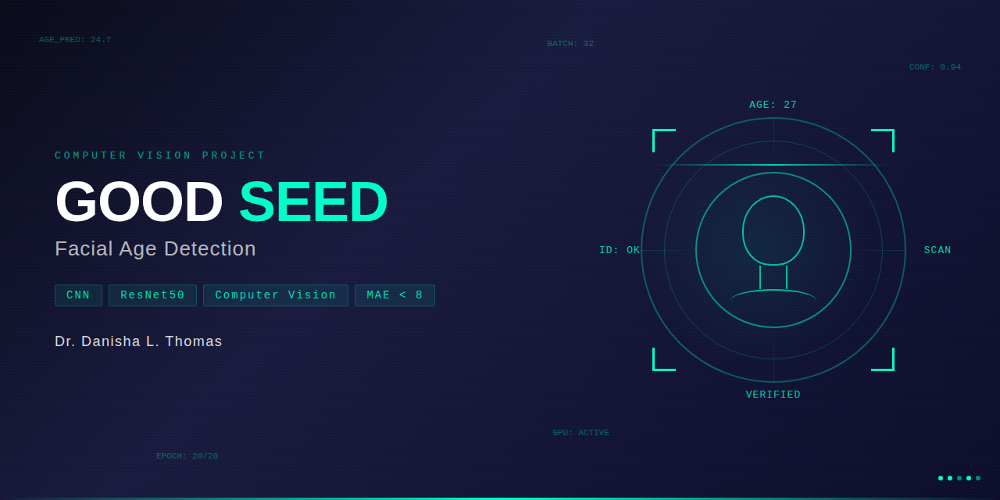

# Good Seed Supermarket — Facial Age Detection (Computer Vision)

**Dr. Danisha L. Thomas** | TripleTen Data Science Bootcamp | Sprint 15

---

## Project Overview

Good Seed, a supermarket chain, seeks to explore whether computer vision can assist in complying with alcohol laws by verifying customer age at the point of sale. This project builds and evaluates a convolutional neural network to predict a person's real age from a facial photograph.

**Primary Metric:** Mean Absolute Error (MAE)  
**Benchmark:** MAE ≤ 8 years  
**Best Validation MAE:** 6.64 years ✅

---

## Dataset

- **7,591 labeled facial images** sourced from the ChaLearn Looking at People competition
- Each image paired with a `real_age` label in `labels.csv`
- Images resized to **224x224 pixels** to meet ResNet50 input requirements
- Age distribution concentrated between 25–40 years, with fewer samples at extremes (<20 and >65)

---

## Methodology

### Model Architecture
- **ResNet50 backbone** with ImageNet pre-trained weights (transfer learning)
- Global Average Pooling layer
- Dense output layer for regression (age prediction)
- Adam optimizer | MSE loss function

### Training
- 20 epochs
- Train/validation split applied
- Data augmentation via ImageDataGenerator (horizontal flip, rotation, zoom)

### Training Results (Selected Epochs)

| Epoch | Train MAE | Val MAE |
|-------|-----------|---------|
| 1 | 7.43 | 8.49 |
| 8 | 4.74 | 6.72 |
| 17 | **3.22** | **6.64** ✅ |
| 20 | 3.18 | 7.65 |

---

## Results

| Metric | Score |
|--------|-------|
| Best Validation MAE | **6.64 years** |
| Benchmark | ≤ 8 years |
| Status | ✅ Passed |

---

## Key Findings & Conclusions

- Computer vision can assist with age verification but has meaningful limitations at the extremes — the model performs well for customers in the 25–40 range but struggles with those under 20 or over 65
- For alcohol sales compliance, a 7–8 year margin is acceptable for older customers but problematic for those near the legal drinking age threshold (18–21)
- Practical applications extend beyond age verification: the model could monitor purchasing trends by consumer age group to inform inventory and marketing decisions
- Model accuracy improves with dataset size — a larger, more balanced dataset across all age groups would improve predictions at the extremes

---

## Tech Stack

`Python` `TensorFlow` `Keras` `ResNet50` `Transfer Learning` `Computer Vision` `NumPy` `Pandas` `Matplotlib` `Jupyter Notebook`

---

## Author

**Dr. Danisha L. Thomas, PhD**  
Data Scientist | Behavioral Intelligence & Healthcare Analytics  
[LinkedIn](https://linkedin.com/in/drdlthomas) | [GitHub](https://github.com/drdanishalthomas)
